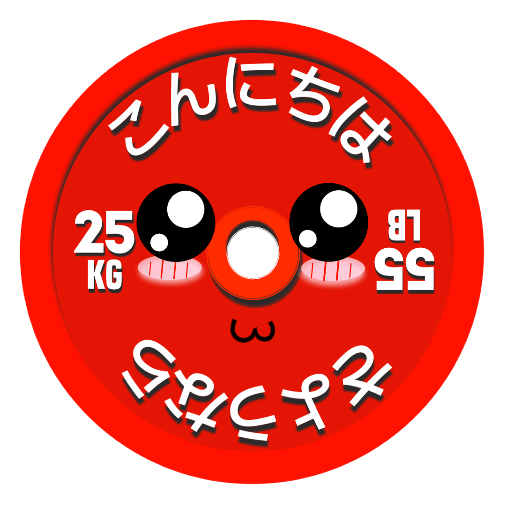

  

# Bar Is Loaded
[Google Play Store](https://play.google.com/store/apps/details?id=com.dongledan.barisloaded)  |   [Apple App Store](https://apps.apple.com/us/app/bar-is-loaded-gym-calculator/id1509374210?ls=1)

[Live Website](https://barisloadedapp.com/)

## Mission
I created this app during my time in quarantine in 2020. I first got the idea for this app after competing in a USAPL powerlifting meet. It was my second meet but first in this federation. Up to the meet, I was training with pound plates and had gotten used to quick maths for loading the bar. However, USAPL uses calibrated KG plates-- on the platform and in the warmup room (depending on venue). Although it's just simple division by 2.2046 to find lb to kg, it was still very annoying. There are a lot of things going on that day and my goal was to have an app to do plate loading calculations with a simple graphic that's easy to follow.

## Features
#### Plate Loading Calculations
* Shows how many plates you need on each side
* Easy to switch between KG or LB plates
* Option to display both KG & LB plates
* Reverse calculator where you choose plates first to determine the weight-- or when weight is already on the bar
* Percent table that automatically calculate the bar
* KG or LB inputs

#### Customizable Inventory
* Ability to change bar weight, remove clips, tailor the plates to what you have on hand

#### Prep
* 1 rep max calculator based on 1 to 10 reps-- perfect for training maxes
* Suggestions for exercises to tackle sticking points. Each exercise is a link to a short YouTube video
* Enter a weight to display your first, second, and third attempts for meet day

#### Powerlifting Points Calculator
* Enter your total and bodyweight to display
  - Wilks Score
  - IPF Points
  - DOTS Score

#### RPE Calculator
* Enter your weight lifted, reps, RPE to display estimated 1 rep max for that day
* Also shows you the next weight based on desired reps and RPE

#### LB | KG
* Ability to switch between LB or KG inputs throughout the app

#### Dark Mode
* Currently only available on iOS 13+ and Android 10+
